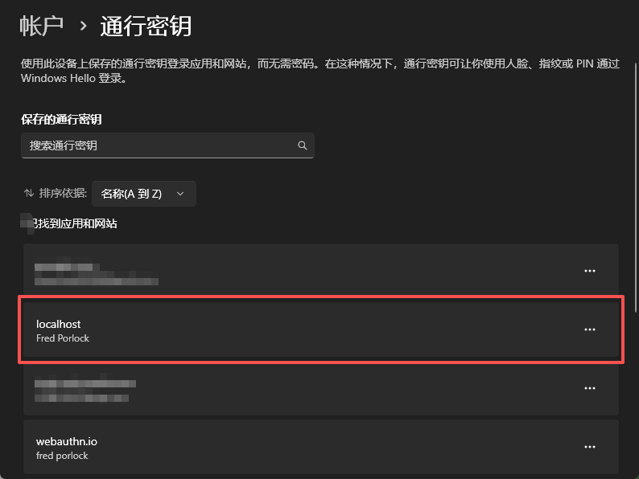

# WebAuthn Demo

## 快速开始 | Quick Start
安装依赖并运行前端 | install modules and run frontend
```powershell
runFrontEnd.bat -i
```

只运行前端，不安装依赖 | run frontend only
```powershell
runFrontEnd.bat
```

安装依赖并运行后端 | install modules and run backend
```powershell
runBackEnd.bat -i
```

只运行后端，不安装依赖 | run backend only
```powershell
runBackEnd.bat
```


## 前端 | Frontend
安装依赖 | install modules
```powershell
npm install
```

运行前端 | run frontend
```powershell
npm run dev
```

## 后端 | Backend
创建并激活虚拟环境 | create and activate virtual environment
```powershell
python -m venv .venv
.\.venv\Scripts\activate
```

安装webauthn和flask库 | install webauthn and flask
```powershell
pip install flask webauthn
```

运行后端app.py | run app.py
```powershell
flask run
```


## 遗留问题 | Known Issues
我没有检验用户是否已经注册过了，所以每次点注册都会生成新的passkey，这导致我电脑上保存了一堆passkey。当我后端重新运行的时候，不知道为什么经常找不到credential id对应的passkey。所以每次测试前要把这个网页的之前的passkey在系统里全部删掉。

Delete all the passkeys of the example website stored in your system before testing, otherwise you cannot find the corresponding passkey for the credential id.

删除passkey方法（Windows）：打开[设置]->[账户]，在[账户设置]中找到[通行密钥]，然后找到网页对应的passkey删除。

How to delete passkeys (Windows): I don't know the exact English path of the settings. It may be [Settings]->[Accounts], then find passkeys, and delete the passkeys of the example website.


图1：删除passkey | Fig1: Delete Passkey


## 博客 | Blog
https://zhuanlan.zhihu.com/p/1969850745634399299