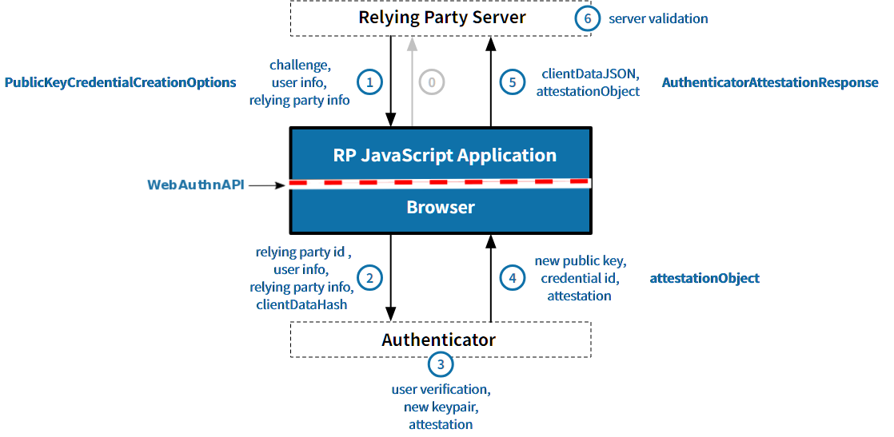
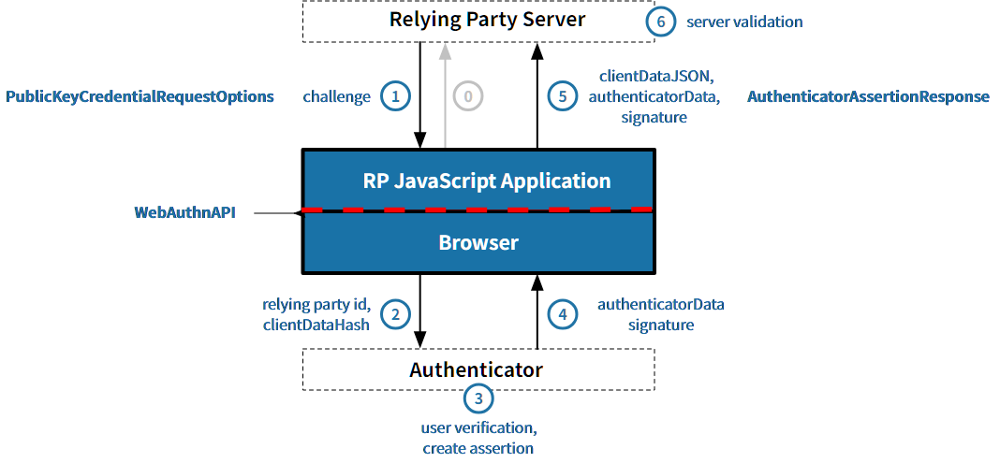
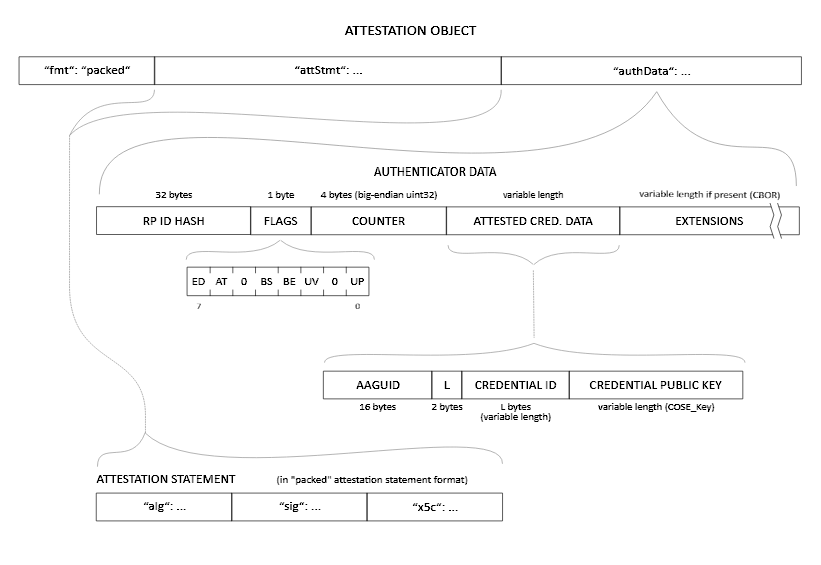

https://w3c.github.io/webauthn/#iface-pkcredential

https://w3c.github.io/webauthn/#dictionary-client-data



---

https://w3c.github.io/webauthn/#dictionary-makecredentialoptions

```javascript
publicKeyCredentialCreationOptions = {
  "rp": {
    "name": "WebAuthn Demo",
    "id": "localhost"
  },
  "user": {
    "id": byte[<=64],
    "name": "Fred Porlock",
    "displayName": "Fred Porlock"
  },
  "challenge": byte[>=16],
  "pubKeyCredParams": [
    {
      "type": "public-key",
      "alg": -7
    },
    {
      "type": "public-key",
      "alg": -8
    },
    {
      "type": "public-key",
      "alg": -257
    }
  ],
  "timeout": 60000,
  "excludeCredentials": [],
  authenticatorSelection: {
    "authenticatorAttachment": "platform"
  },
  "attestation": "none"
}
```

pubKeyCredParams.alg signature algorithms:  
* -8 (EdDSA)
* -7 (ES256)
* -257 (RS256)  
https://www.iana.org/assignments/cose/cose.xhtml#algorithms

excludeCredentials:  
List any existing credentials mapped to this user account  
Ensure that the new credential is not created on an authenticator that already contains a credential mapped to this user account.
用户已有凭证列表，防止重复创建

attestation:  
* none: the server does not care about attestation
* indirect: the server will allow for anonymized attestation data
* direct: the server wants to receive the attestation data from the authenticator

authenticatorSelection.authenticatorAttachment:
* platform: built-in authenticator (e.g., Touch ID, Windows Hello)
* cross-platform: external authenticator (e.g., YubiKey)

---

```javascript
createdCredential = {
  "authenticatorAttachment": "platform",
  "id": "JliNXEugx1_dEwhIw0LZtyv6xlSnnLk0pY0rsi4C8cc",
  "rawId": byte[<=1023],
  "response": {
    "attestationObject": "o2NmbXRkbm9uZWdhdHRTdG10oGhhdXRoRGF0YVikSZYN5YgOjGh0NBcPZHZgW4_krrmihjLHmVzzuoMdl2NFAAAAAAiYcFjK3EuBtuEw3lDcvpYAICZYjVxLoMdf3RMISMNC2bcr-sZUp5y5NKWNK7IuAvHHpQECAyYgASFYIGT_5Y3v45_8sNdLb0ezjVoGT2_iyMEl6XJyU7Rw4RwLIlggkfr8fBlw_DJaqKMCEyFqwifrhoVIKxjZxzSdLX5tlnY",
    "authenticatorData": "SZYN5YgOjGh0NBcPZHZgW4_krrmihjLHmVzzuoMdl2NFAAAAAAiYcFjK3EuBtuEw3lDcvpYAICZYjVxLoMdf3RMISMNC2bcr-sZUp5y5NKWNK7IuAvHHpQECAyYgASFYIGT_5Y3v45_8sNdLb0ezjVoGT2_iyMEl6XJyU7Rw4RwLIlggkfr8fBlw_DJaqKMCEyFqwifrhoVIKxjZxzSdLX5tlnY",
    "clientDataJSON": "eyJ0eXBlIjoid2ViYXV0aG4uY3JlYXRlIiwiY2hhbGxlbmdlIjoidHRDUklSUmM3ODNHckY1dGtMMU9PVGQ1Q0ZMejBSbWRhTTBOOUZsTGJBTW1EQkxpUGNlNENLQnI2bDdXUXJFZHVfYkdfcWo5XzVfZFhROGtzNUFjVWciLCJvcmlnaW4iOiJodHRwOi8vbG9jYWxob3N0OjUxNzMiLCJjcm9zc09yaWdpbiI6ZmFsc2V9",
    "publicKey": "MFkwEwYHKoZIzj0CAQYIKoZIzj0DAQcDQgAEZP_lje_jn_yw10tvR7ONWgZPb-LIwSXpcnJTtHDhHAuR-vx8GXD8MlqoowITIWrCJ-uGhUgrGNnHNJ0tfm2Wdg",
    "publicKeyAlgorithm": -7,
    "transports": [
      "internal"
    ]
  },
  "type": "public-key"
}
```

id:  
base64url encoding of rawId

authenticatorAttachment:
* platform
* cross-platform
